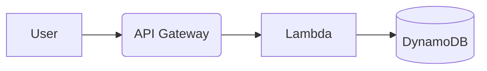

# AWS Certifications & Study Notes

Welcome to my AWS certification repository! This project organizes my **study notes** and **official certificates** for AWS cloud certifications.  

## Certifications

| Certification | Notes | Certificate | Status |
|--------------|-------|-------------|--------|
| [AWS Certified Cloud Practitioner](AWS-Cloud-Practitioner/) | [📝 Notes](AWS-Cloud-Practitioner/Notes.md) | [📜 PDF](AWS-Cloud-Practitioner/Certificate.pdf) |  Obtained |
| [AWS Data Engineer Associate](AWS-Data-Engineer-Associate/) | [📝 Notes](AWS-Data-Engineer-Associate/Notes.md) | [📜 PDF](AWS-Data-Engineer-Associate/Certificate.pdf) |  Obtained |

---

## Repository Structure
```
AWS-Certifications/
├── AWS-Cloud-Practitioner/
│   ├── Notes.md          # Detailed study notes
│   ├── Cheat-Sheet.md    # Quick reference guide
│   └── Certificate.pdf   # Official certificate
│
├── AWS-Data-Engineer-Associate/
│   ├── Notes.md
│   ├── Labs/             # Hands-on exercises
│   └── Certificate.pdf
│
└── README.md             # You are here!
```

---

## How to Use
- **For Recruiters**: Click the PDF links above to verify my certifications.
- **For Learners**: Feel free to use my notes! All materials are open-source (see [License](#-license)).
- **For Me**: Tracking my AWS learning journey with structured documentation.

---

## Notes Style
- **Code Snippets**: AWS CLI, Python (boto3), Terraform examples.
- **Diagrams**: Architecture visuals using Mermaid.js.
- **Key Topics**: Focus on services, best practices, and exam tips.

---

## License
This repository is licensed under [MIT License](LICENSE.md).  
_Note: Certificates are personal credentials; do not redistribute PDFs._

---

## Connect With Me
- [LinkedIn](www.linkedin.com/in/morobang-tshigidimisa-84172b26b)
- [Personal Website](https://yourwebsite.com)
- Email: morobangtshigidimisa

---

> "Documentation is the love letter you write to your future self." — Unknown
```

---

### Key Features:
1. **Professional Table**: Clear status tracking (✅/🚧) for certifications.
2. **Mobile-Friendly**: Clean Markdown formatting.
3. **Transparent Usage**: Clarifies who should use what (recruiters vs. learners).
4. **Future-Proof**: Easy to add more certifications by copying folder structure.

**Pro Tip**: Add a [Mermaid.js](https://mermaid.js.org/) diagram in your notes to visualize AWS architectures! Example:
````markdown

````

Let me know if you'd like to tweak any sections!